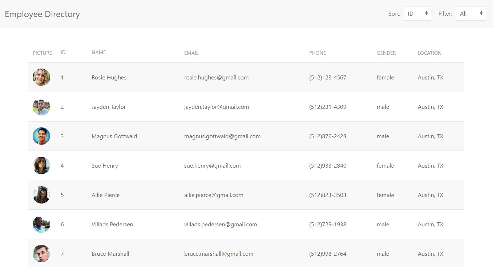
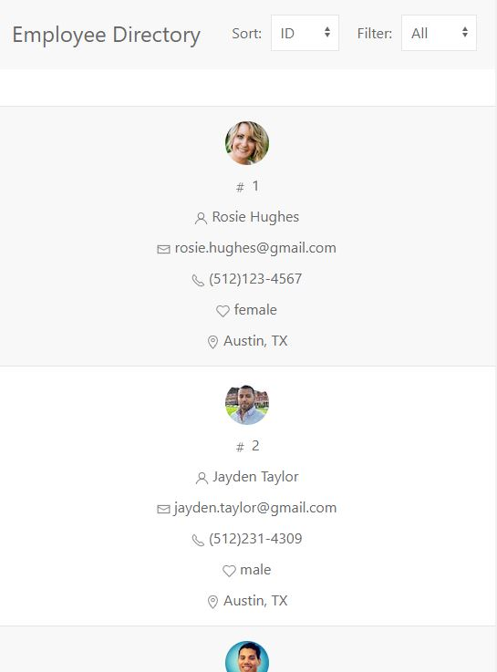

# 19 Employee Directory
> A simple employee directory app developed with React

This was a homework assignment where I created an employee directory with React. This assignment required me to break up my application's UI into components, manage component state, and respond to user events.

## Completed

* Rendered a table of employees on page load
* Sort functionality by id and name
* Filter functionality by gender -- male or female
* Broke up app's UI into components
* Managed component state
* Responds to user events

## User Story

* As a user, I want to be able to view my entire employee directory at once so that I have quick access to their information.

## Deployed App  
[Employee Directory](https://github.com/aroblesgalit/19-employee-directory)

## Screenshot 

